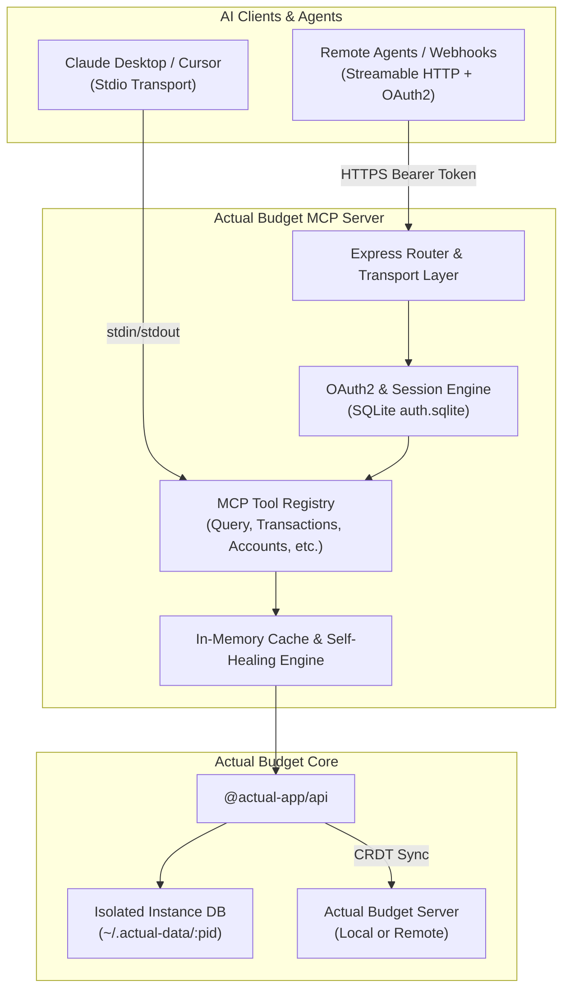
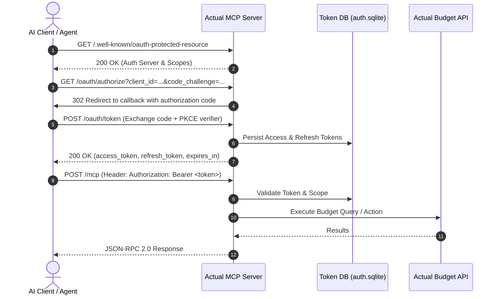

# Actual Budget MCP Server

[](https://modelcontextprotocol.io)
[](https://nodejs.org/)
[](LICENSE)

An enterprise-ready [Model Context Protocol (MCP)](https://modelcontextprotocol.io) server for [Actual Budget](https://actualbudget.com/).

This server enables AI assistants and autonomous agents (such as Claude Desktop, Google Antigravity, Cursor, and custom orchestrators) to securely query, reconcile, analyze, and manage personal finances using the official Actual Budget API.

---

## Features

- **Dual Transport Protocols**:
  - **Stdio Transport**: Native standard input/output transport for desktop tools (Claude Desktop, Cursor, local agent runners).
  - **Streamable HTTP Transport (MCP spec 2025-11-25)**: Modern, multi-session HTTP endpoint (`/mcp`) supporting stateful sessions, SSE, and remote agents.
- **Production-Ready OAuth2 Authentication**:
  - RFC 8414 & OpenID Connect Discovery metadata endpoints.
  - RFC 9728 OAuth 2.0 Protected Resource Metadata (`/.well-known/oauth-protected-resource`).
  - Authorization Code Grant with PKCE (S256), Refresh Token Grant, and RFC 7009 Token Revocation.
  - Persistent SQLite token storage (`data/auth.sqlite`) with WAL mode, auto-expiration, and security audit activity logging.
  - Redirect URI domain restriction (`ALLOWED_REDIRECT_DOMAINS`).
  - Optional `--no-auth` mode for private or local networks.
- **High Performance & Resilience**:
  - Persistent in-process connection via official `@actual-app/api` (no subprocess spawning per command).
  - In-memory caching for accounts, categories, category groups, payees, and tags.
  - Process-level SQLite corruption self-healing and PID-isolated instance data directories.
  - Automatic Schema Mismatch detection & package auto-upgrades (`@actual-app/api` and `@actual-app/cli`).
- **Comprehensive Budget Toolset**:
  - Full query engine using ActualQL (`actual_query`) with filters, order-by, grouping, pagination, and count.
  - Full CRUD operations for accounts, transactions (including split transactions), categories, category groups, payees, tags, rules, and schedules.
  - Dynamic skill documentation resource (`actual://skill-docs`) and system prompt guidance.

---

## Architecture



---

## OAuth2 Authentication & Session Flow



---

## Getting Started

### Prerequisites

- **Node.js**: `v20.0.0` or higher
- An **Actual Budget** server instance (self-hosted or hosted)

### Installation

```bash
git clone https://github.com/your-username/actual-mcp.git
cd actual-mcp
npm install
```

---

## Configuration

You can configure `actual-mcp` using environment variables (via a `.env` file or exported in your shell) or via `~/.actualrc.json`.

Copy the example environment template:

```bash
cp .env.example .env
```

### Environment Variables

| Variable | Description | Default |
|---|---|---|
| `PORT` | Port for the HTTP / MCP server | `3000` |
| `NO_AUTH` | Disable OAuth2 authentication on HTTP transport (`true` or `false`) | `false` |
| `ACTUAL_SERVER_URL` | URL of your Actual Budget server | `http://localhost:5006` |
| `ACTUAL_PASSWORD` | Server password for Actual Budget | — |
| `ACTUAL_SYNC_ID` | Sync ID of the budget file | — |
| `ACTUAL_ENCRYPTION_PASSWORD`| End-to-end encryption password (if enabled on budget) | — |
| `ACTUAL_DATA_DIR` | Root directory for isolated instance SQLite databases | `~/.actual-data` |
| `ACTUAL_RC_PATH` | Path to `.actualrc.json` configuration file | `~/.actualrc.json` |
| `ACTUAL_SKILL_PATH` | Path to custom Markdown skill guide for `actual://skill-docs` | Built-in guide |
| `OAUTH_CLIENT_ID` | OAuth2 Client ID | — |
| `OAUTH_CLIENT_SECRET` | OAuth2 Client Secret | — |
| `ALLOWED_REDIRECT_DOMAINS` | Comma-separated allowed hostnames for OAuth redirects | `oauth-redirect.googleusercontent.com,localhost` |

### Configuration via `~/.actualrc.json`

If environment variables are not set, `actual-mcp` automatically reads connection details from `~/.actualrc.json`:

```json
{
  "serverUrl": "http://localhost:5006",
  "password": "your_server_password",
  "syncId": "your_sync_id",
  "encryptionPassword": "your_encryption_password"
}
```

---

## Usage

### 1. Stdio Mode (Claude Desktop / Cursor)

Add the server to your `claude_desktop_config.json`:

```json
{
  "mcpServers": {
    "actual": {
      "command": "node",
      "args": [
        "/path/to/actual-mcp/index.js"
      ],
      "env": {
        "ACTUAL_SERVER_URL": "http://localhost:5006",
        "ACTUAL_PASSWORD": "your_server_password",
        "ACTUAL_SYNC_ID": "your_sync_id",
        "ACTUAL_ENCRYPTION_PASSWORD": "your_encryption_password"
      }
    }
  }
}
```

### 2. Streamable HTTP Mode (Standalone Server)

Start the HTTP server on port 3000:

```bash
# With OAuth2 authentication enabled (requires OAUTH_CLIENT_ID and OAUTH_CLIENT_SECRET):
node index.js --port 3000

# With OAuth2 authentication disabled (trusted local network):
node index.js --port 3000 --no-auth
```

Once running:
- **MCP Endpoint**: `http://localhost:3000/mcp`
- **Health Check**: `http://localhost:3000/health`
- **OAuth Discovery**: `http://localhost:3000/.well-known/oauth-authorization-server`
- **OAuth Protected Resource Metadata**: `http://localhost:3000/.well-known/oauth-protected-resource`

### 3. Cleanup Stale Processes

If previous instances crashed or left zombie processes:

```bash
npm run cleanup
```

---

## Tool Reference

| Tool Name | Category | Description |
|---|---|---|
| `actual_query` | Query | Execute an ActualQL query against tables (`transactions`, `accounts`, `categories`, `payees`, `rules`, `schedules`). |
| `actual_query_tables` | Query | List all queryable database tables. |
| `actual_query_fields` | Query | List queryable fields for a specified table. |
| `actual_list_accounts` | Accounts | List all active or closed accounts with current balances. |
| `actual_create_account` | Accounts | Create a new budget or off-budget account. |
| `actual_update_account` | Accounts | Update account name or off-budget status. |
| `actual_get_account_balance` | Accounts | Get current balance of an account with optional date cutoff. |
| `actual_list_transactions` | Transactions | List transactions filtered by account and date range. |
| `actual_add_transactions` | Transactions | Add one or more transactions (supports split transactions). |
| `actual_update_transaction`| Transactions | Update fields (notes, category, amount, payee) on a transaction. |
| `actual_delete_transaction`| Transactions | Delete a transaction by ID. |
| `actual_list_categories` | Categories | List budget categories and category groups. |
| `actual_create_category` | Categories | Create a new budget category. |
| `actual_list_payees` | Payees | List payees or retrieve transfer payees. |
| `actual_create_payee` | Payees | Create a new payee. |
| `actual_list_rules` | Rules | List transaction categorization rules. |
| `actual_list_schedules` | Schedules | List recurring payment and deposit schedules. |
| `actual_sync_budget` | Sync | Trigger a sync with the remote Actual Budget server. |
| `actual_get_id` | Resolver | Helper tool to resolve account, category, or category group names into UUIDs. |

---

## License

This project is licensed under the [MIT License](LICENSE).
